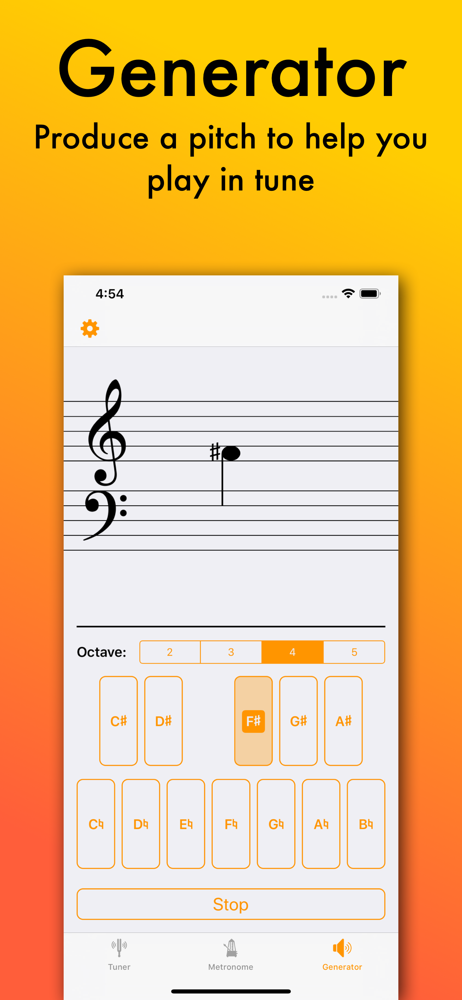

# Cello Mute: Tuner, Metronome, Tone Generator
**Cello Mute is a musician's toolbox; it contains the utilities necessary to play or sing in tune and in time.** 

* _Tuner_: Find the perfect pitch for your instrument
* _Metronome_: Select from any combination of time signatures and subdivisions
* _Generator_: Play a melodic line while tuning intervals to a generated note

Cello Mute is available on the App Store: <https://apps.apple.com/us/app/cello-mute/id1132914994>

## Getting Started

Cello Mute uses Cocoapods. Clone the repository and run `pod install` to install dependencies.

## Screenshots

